# Module 01A - Incremental Copy to Raw (using Change Data Capture)

[< Previous Module](../modules/module00.md) - **[Home](../README.md)** - [Next Module >](../modules/module01b.md)

## :thinking: Prerequisites

- [x] Lab environment deployed

## :loudspeaker: Introduction

In this module, we will setup a Synapse Pipeline to incrementally copy data from an OLTP source (Azure SQL Database), leveraging Change Data Capture technology to isolate changes. The data will be copied to the raw layer of our Azure Data Lake Storage Gen2 account.

## :dart: Objectives

* Enable Change Data Capture on source table(s)
* Create a Pipeline to copy data changes to the data lake

## 1. Source Environment (dbo.Customers)

Initialize the source environment by creating a table, enabling CDC on the table, and populating the table with data.

1. Navigate to the **SQL database**

    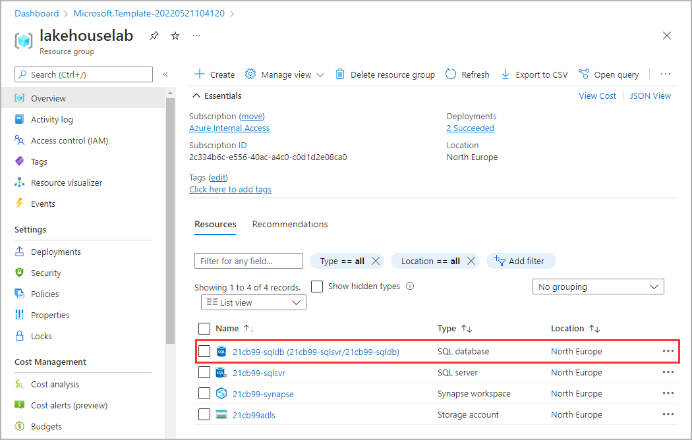

2. Click **Query editor**

    

3. Click **Continue us <your_alias>@<your_domain>.com**

    

4. To create the source table, copy and paste the code snippet below and click **Run**

```sql
CREATE TABLE Customers (
    CustomerID int IDENTITY(1,1) PRIMARY KEY,
    CustomerAddress varchar(255) NOT NULL
);
```


5. To enable change data capture on the source table, copy and paste the code snippet below and click **Run**

```sql
EXEC sys.sp_cdc_enable_db;
EXEC sys.sp_cdc_enable_table  
    @source_schema = N'dbo',  
    @source_name   = N'Customers',  
    @role_name     = NULL,
    @supports_net_changes = 1;
```


6. To load the source table with data, copy and paste the code snippet below and click **Run**

```sql
INSERT INTO dbo.Customers (CustomerAddress)
VALUES
    ('82 Margate Drive, Sheffield S4 8FQ'),
    ('135 High Barns, Ely, CB7 4RH'),
    ('39 Queen Annes Drive, Bedale, DL8 2EL');
```


<div align="right"><a href="#module-01a---incremental-copy-to-raw-using-change-data-capture">↥ back to top</a></div>

## 2. Linked Service (Azure SQL Database)

Creating a linked service provides Azure Synapse Analytics the necessary information to establish connectivity to an external resource, in this case, an Azure SQL Database.

1. Navigate to the **Synapse workspace**

    

2. Open **Synapse Studio**

    

3. Navigate to the **Manage** hub

    

4. Click **Linked services**

    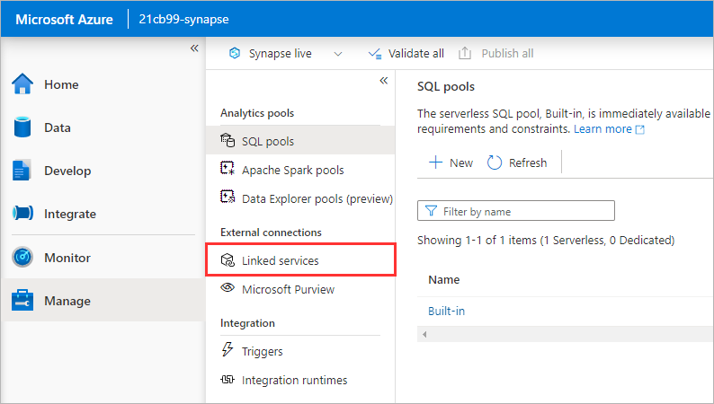

5. Click **New**

    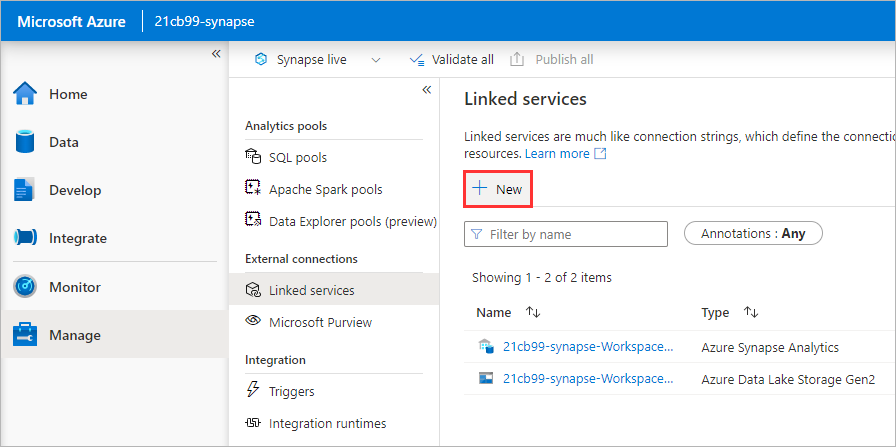

6. Search `SQL`, select **Azure SQL Database**, and click **Continue**

    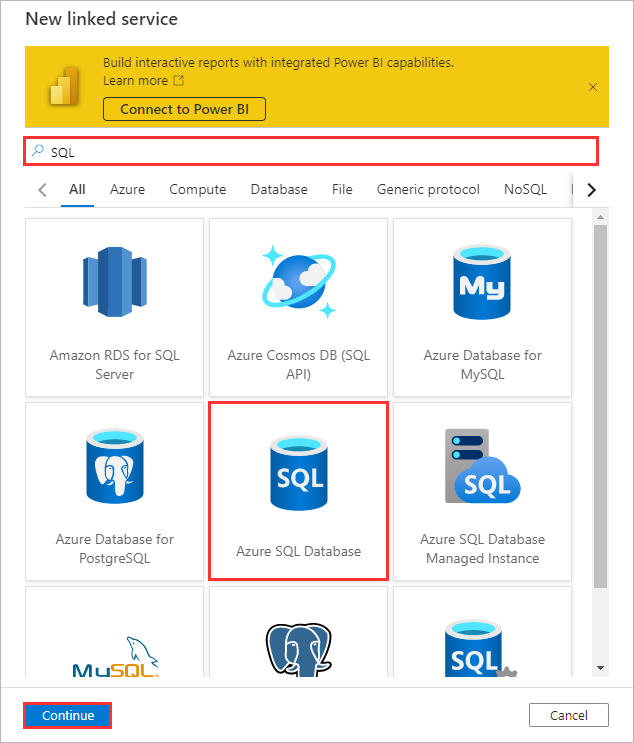

7. Rename the Linked Service to `AzureSqlDatabase`

    

8. Select the target Azure SQL Database by selecting the **Azure subscription**, **Server name** and **Database name**

    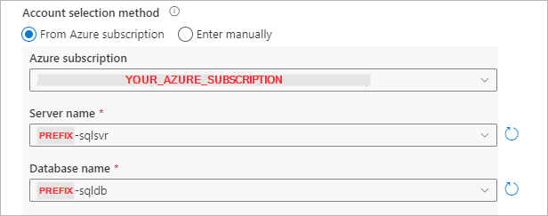

9. Set the **Authentication** type to `SQL authentication`

    

10. Copy and paste the **User name**

```text
sqladmin
```


11. Copy and paste the **Password**

```text
sqlPassword!
```


12. Click **Test connection**

    

13. Click **Create**

    

<div align="right"><a href="#module-01a---incremental-copy-to-raw-using-change-data-capture">↥ back to top</a></div>

## 3. Integration Dataset (Azure SQL Database - Table)

An integration dataset is simply a named reference to data that can be used in an activity as an input or output. In this example, we are creating a reference to tables within our Azure SQL Database and leveraging parameters to be able to dynamically specify the schema and table name at runtime.

1. Navigate to the **Data** hub

    

2. Switch to the **Linked** tab

    

3. Click the **[+]** icon to add a new resource and click **Integration dataset**

    

4. Search `SQL`, select **Azure SQL Database**, and click **Continue** 

    

5. Rename the Integration Dataset to `AzureSqlTable`

    

6. Select the Linked service `AzureSqlDatabase`

    

7. Click **OK**

    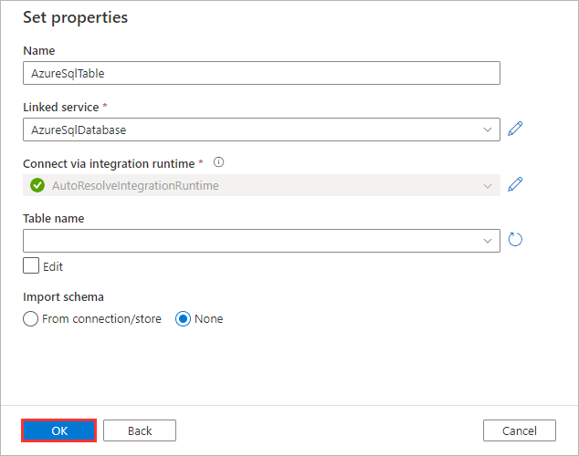

8. Switch the the **Parameters** tab

    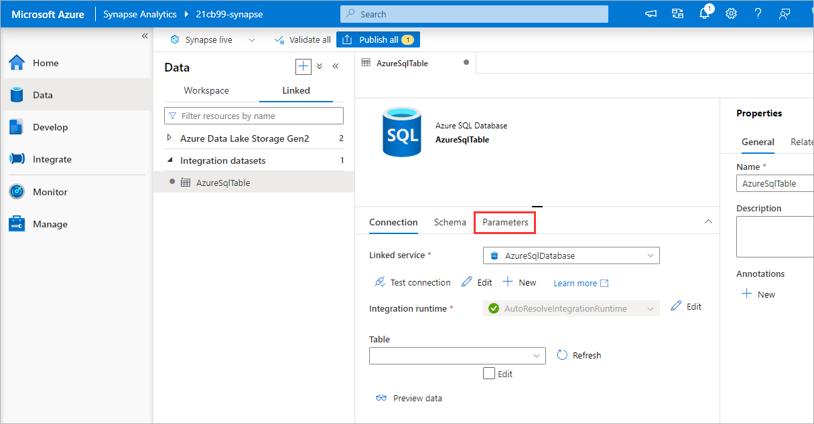

9. Click **New**

    

10. Set the Name to `schema`

    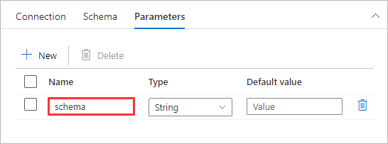

11. Click **New**

    

12. Set the Name to `table`

    

13. Switch to the **Connection** tab

    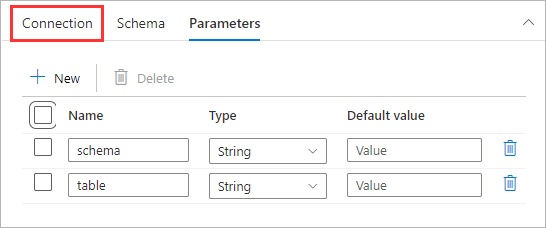

14. Beneath the **Table** dropdown menu, select the **Edit** checkbox

    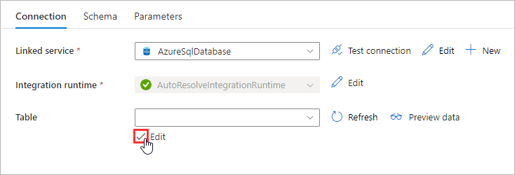

15. Click inside the first text input for **Table** and click **Add dynamic content**

    

16. Under **Parameters**, click `schema`

    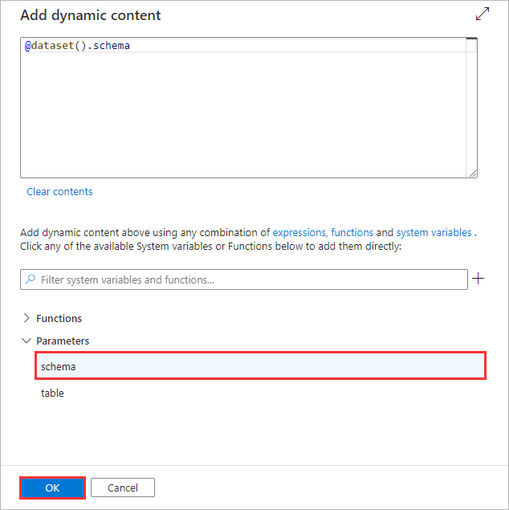

17. Click **OK**

    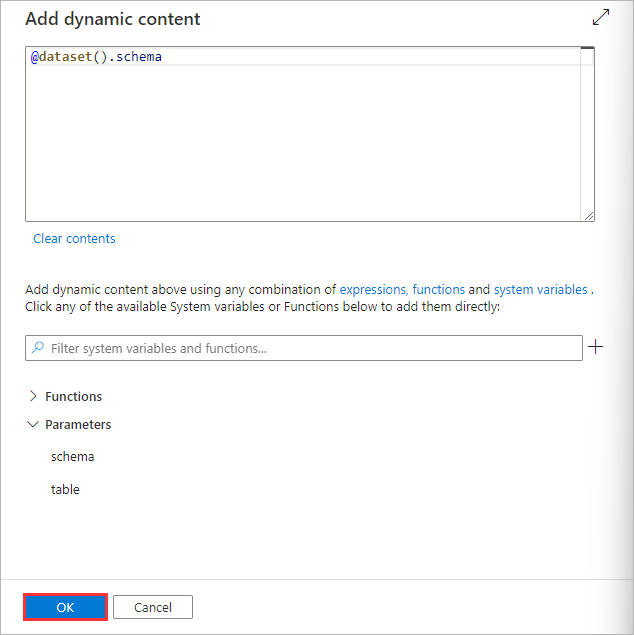

18. Click inside the second text input for **Table** and click **Add dynamic content**

    

19. Under **Parameters**, click `table`

    

20. Click **OK**

    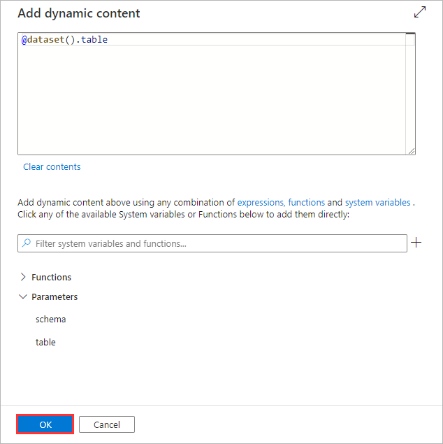

21. Click **Publish all**

    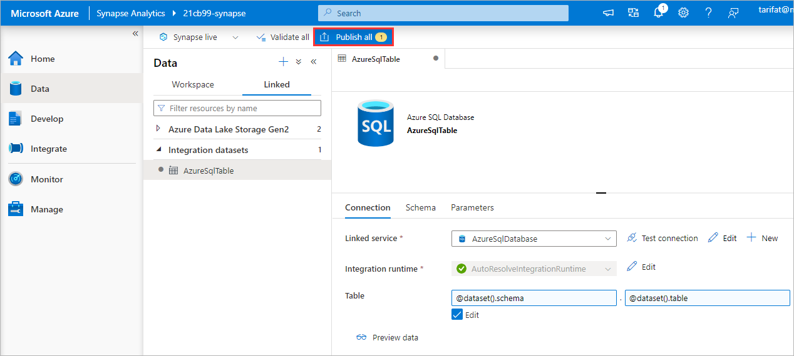

22. Click **Publish**

    

<div align="right"><a href="#module-01a---incremental-copy-to-raw-using-change-data-capture">↥ back to top</a></div>

## 4. Integration Dataset (Azure Data Lake Storage Gen2 - Raw)

In this example, we are creating a reference to delimited text files (i.e. CSV) within our Azure Data Lake Gen2 Storage Account and leveraging parameters to be able to dynamically specify the folder path and file name at runtime.

1. Navigate to the **Data** hub

    

2. Switch to the **Linked** tab

    

3. Click the **[+]** icon to add a new resource and click **Integration dataset**

    

4. Search `Data Lake`, select **Azure Data Lake Storage Gen2**, and click **Continue** 

    

5. Select **DelimitedText** and click **Continue**

    

6. Rename the integration dataset to `AdlsRawDelimitedText`

    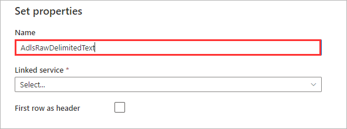

7. Select the Azure Synapse Analytics workspace default storage **Linked service**

    

8. Click the **browse** icon

    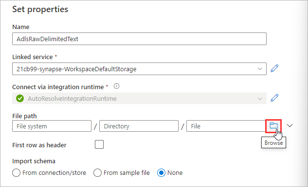

9. Select `01-raw` and click **OK**

    

10. Select **First row as header** and click **OK**

    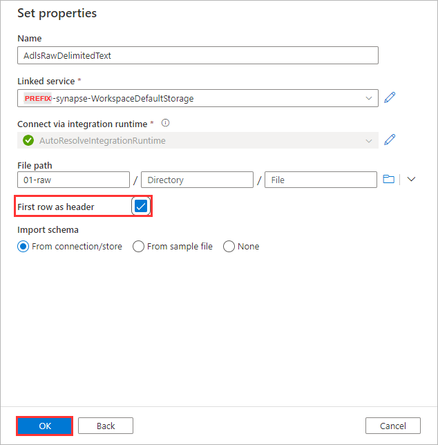

11. Switch to the **Parameters** tab

    

12. Click **New**

    

13. Set the Name to `folderPath`

    

14. Click **New**

    

15. Set the Name to `fileName`

    

16. Switch to the **Connection** tab

    

17. Click inside the `Directory` text input and click **Add dynamic content**

    

18. Under **Parameters**, select `folderPath` and click **OK**

    

19. Click inside the `File` text input and click **Add dynamic content**

    

20. Under **Parameters**, select `fileName` and click **OK**

    

21. Click **Publish all**

    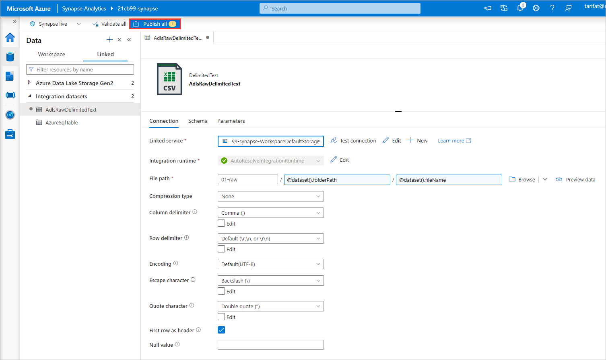

22. Click **Publish**

    

<div align="right"><a href="#module-01a---incremental-copy-to-raw-using-change-data-capture">↥ back to top</a></div>

## 5. Pipeline (Lookup)

A pipeline is a data-driven workflow, logically grouping activities to perform a task (e.g. ingest and load). Once our pipeline is created, we will add our first activity - Lookup. The Lookup activity can retrieve a dataset from any of the data sources supported by Synapse pipelines. In this example, we will be executing SQL against our Azure SQL Database to determine the number of changes that have occurred to the target table for a given time period.

1. Navigate to the **Integrate** hub
2. Click the **[+]** icon to add a new resource and click **Pipeline**
3. Rename the pipeline to `C1 - pipelineIncrementalCopyCDC`
4. Under **Parameters** click **New**
5. Set the Name to `triggerStartTime`
6. Click **New**
7. Set the Name to `triggerEndTime`
8. Within Activities, search for `Lookup`, and drag the **Lookup activity** onto the canvas
9. Rename the activity `GetChangeCount`
10. Switch to the **Settings** tab
11. Set the **Source dataset** to **AzureSqlTable**
12. Set the Dataset property **schema** to `cdc`
13. Set the Dataset property **table** to `dbo_Customers_CT`
14. Set the **Use query** property to **Query**
15. Click inside the **Query** text input and click **Add dynamic content** 
16. Copy and paste the code snippet and click **OK**
```
@concat('DECLARE @begin_time datetime, @end_time datetime, @from_lsn binary(10), @to_lsn binary(10); 
SET @begin_time = ''',pipeline().parameters.triggerStartTime,''';
SET @end_time = ''',pipeline().parameters.triggerEndTime,''';
SET @from_lsn = sys.fn_cdc_map_time_to_lsn(''smallest greater than or equal'', @begin_time);
SET @to_lsn = sys.fn_cdc_map_time_to_lsn(''largest less than'', @end_time);
IF (@from_lsn IS NOT NULL AND @to_lsn IS NOT NULL AND @from_lsn < @to_lsn)
SELECT count(1) changecount FROM cdc.fn_cdc_get_net_changes_dbo_Customers(@from_lsn, @to_lsn, ''all'')
ELSE SELECT 0 changecount')
```
18. Click **Preview data**
19. Provide a value for **triggerStartTime** that is a date before today (e.g. `2022-01-01`)
20. Provide a value for **triggerEndTime** that is a data in the future (e.g. `9999-12-31`)
21. Click **OK**
22. You should see a changecount of 3, close the Preview data window
23. On the **Integrate** pane, click the ellipses button next to **Pipelines**, and select **New folder**
24. Rename the folder to `Customers` and click **Create**
25. Click on the ellipses button next to `C1 - pipelineIncrementalCopyCDC` and select **Move item**
26. Select the **Customers** folder and click **Move**
27. Click **Publish all**
28. Click **Publish**

<div align="right"><a href="#module-01a---incremental-copy-to-raw-using-change-data-capture">↥ back to top</a></div>

## 6. Pipeline (If Condition, Copy data)

In this step, we will be adding an If Condition activity to our pipeline. The If Condition activity provides comparable functionality to an if statement found in programming languages. It can execute a set of activities if a condition evaluates to `true`, and another set of activities if the condition evaluates to `false`. In this example, we are going to only proceed with a subsequent Copy activity if the number of changes detected is greater than zero.

1. Within Activities, search for `If`, and drag the **If Condition activity** onto the canvas
2. Click and drag on the green button from the **Lookup** to the **If Condition** to establish a connection
3. Rename the **If Condition** activity to `HasChangedRows`
4. Switch to the **Activities** tab
5. Click inside the **Expression** text input and click **Add dynamic content**
6. Copy and paste the code snippet and click **OK**
```
@greater(int(activity('GetChangeCount').output.firstRow.changecount),0)
```
8. Within the **True** case, click the **pencil** icon
9. Within Activities, search for `Copy`, and drag the **Copy data** activity onto the canvas
10. Rename the **Copy** activity to `copyIncrementalData`
11. Switch to the **Source** tab
12. Set **Source dataset** to **AzureSqlTable**
13. Under **Dataset properties**, set the **schema** to `cdc`
14. Under **Dataset properties**, set the **table** to `dbo_Customers_CT`
15. Set **Use query** to **Query**
16. Click inside the **Query** text input and click **Add dynamic content** 
17. Copy and paste the code snippet and click **OK**
```
@concat('DECLARE @begin_time datetime, @end_time datetime, @from_lsn binary(10), @to_lsn binary(10); 
SET @begin_time = ''',pipeline().parameters.triggerStartTime,''';
SET @end_time = ''',pipeline().parameters.triggerEndTime,''';
SET @from_lsn = sys.fn_cdc_map_time_to_lsn(''smallest greater than or equal'', @begin_time);
SET @to_lsn = sys.fn_cdc_map_time_to_lsn(''largest less than'', @end_time);
SELECT CustomerID, CustomerAddress FROM cdc.fn_cdc_get_net_changes_dbo_Customers(@from_lsn, @to_lsn, ''all'')')
```
18. Switch to the **Sink** tab
19. Set **Sink dataset** to **AdlsRawDelimitedText**
20. Under **Dataset properties**, set the **folderPath** to `wwi/customers`
21. Under **Dataset properties**, click inside the **fileName** text input and click **Add dynamic content**
22. Copy and paste the code snippet and click **OK**
```
@concat(formatDateTime(pipeline().parameters.triggerStartTime,'yyyyMMddHHmmssfff'),'.csv')
```
22. Navigate back up to the pipeline and click **Publish all**
23. Click **Publish**
24. Click **Debug**
25. Provide a value for **triggerStartTime** that is a date before today (e.g. `2022-01-01`)
26. Provide a value for **triggerEndTime** that is a data in the future (e.g. `9999-12-31`)
27. Click **OK**
28. When the pipeline run is complete, under the **Output** tab, click the **Details** icon of the Copy data activity to confirm that three rows have been written to the data lake.
29. You can also navigate to the **Data** hub, browse the data lake folder structure under the **Linked tab** to `01-raw/wwi/customers`, right-click the CSV file and select **New SQL Script > Select TOP 100 rows**
30. Modify the SQL statement to include `HEADER_ROW = TRUE` within the OPENROWSET function and click **Run**

<div align="right"><a href="#module-01a---incremental-copy-to-raw-using-change-data-capture">↥ back to top</a></div>

## 7. Load Additional Data into dbo.Customers

Before we can test that our pipeline is able to successfully isolate and copy changes from a particular time period, we must perform changes to our source table (e.g. UPDATE existing rows, INSERT new rows).

1. Navigate to the **SQL database**
2. Click **Query editor**
3. Click **Continue us <your_alias>@<your_domain>.com**
4. Copy and paste the code snippets below and click **Run**
```sql
UPDATE dbo.Customers SET CustomerAddress = 'Guyzance Cottage, Guyzance NE65 9AF' WHERE CustomerID = 3;
INSERT INTO dbo.Customers (CustomerAddress)
VALUES
    ('322 Fernhill, Mountain Ash, CF45 3EN'),
    ('381 Southborough Lane, Bromley, BR2 8BQ');
SELECT * FROM [dbo].[Customers];
```
5. Copy and paste the code snippet below and click **Run**. Note: There may be some latency between the changes being executed and the changes being recorded in the related CDC table. You may need to wait a minute or two between steps to get the correct `start_time` and `end_time` values.
```sql
DECLARE @max_lsn binary(10);
SET @max_lsn = sys.fn_cdc_get_max_lsn();  
SELECT
CONVERT(varchar(16), DATEADD(minute, -1, sys.fn_cdc_map_lsn_to_time(@max_lsn)), 20) as start_time,
CONVERT(varchar(16), DATEADD(minute, 1, sys.fn_cdc_map_lsn_to_time(@max_lsn)), 20) as end_time
```
6. Copy and paste the `start_time` and `end_time` values into a text editor (e.g. Notepad). This will be used as input for the pipeline rerun to isolate the second batch of changes made to the dbo.Customers table.

<div align="right"><a href="#module-01a---incremental-copy-to-raw-using-change-data-capture">↥ back to top</a></div>

## 8. Rerun Pipeline to Copy Additional Data

Using the `start_time` and `end_time` values from the previous step, we will rerun our pipeline and confirm that the changes have been copied to the Azure Data Lake Gen2 Storage Account.

1. Navigate to the **Synapse workspace**
2. Open **Synapse Studio**
2. Navigate to the **Integration** hub
3. Open pipeline `C1 - pipelineIncrementalCopyCDC`
4. Click **Debug**
5. Copy and paste the `start_time` and `end_time` values into the `triggerStartTime` and `triggerEndTime` parameters and click **OK**
6. When the pipeline run is complete, under the **Output** tab, click the **Details** icon of the Copy data activity to confirm that three rows have been written to the data lake.
7. You can also navigate to the **Data** hub, browse the data lake folder structure under the **Linked tab** to `01-raw/wwi/customers`, right-click the second CSV file and select **New SQL Script > Select TOP 100 rows**
8. Modify the SQL statement to include `HEADER_ROW = TRUE` within the OPENROWSET function and click **Run**

<div align="right"><a href="#module-01a---incremental-copy-to-raw-using-change-data-capture">↥ back to top</a></div>

## :tada: Summary

You have successfully setup a pipeline that can check for changes in the source system and copy those changes to the raw layer within your data lake.

[Continue >](../modules/module01b.md)