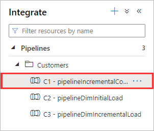
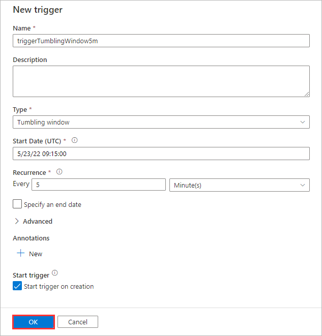
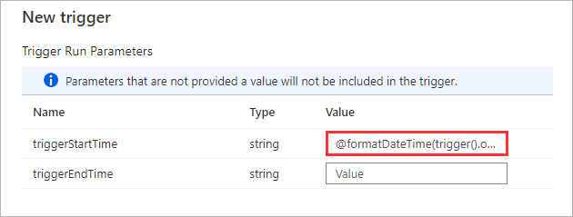
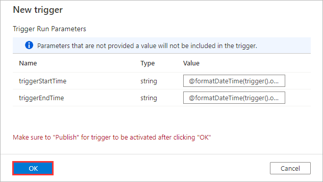
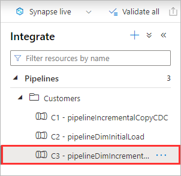
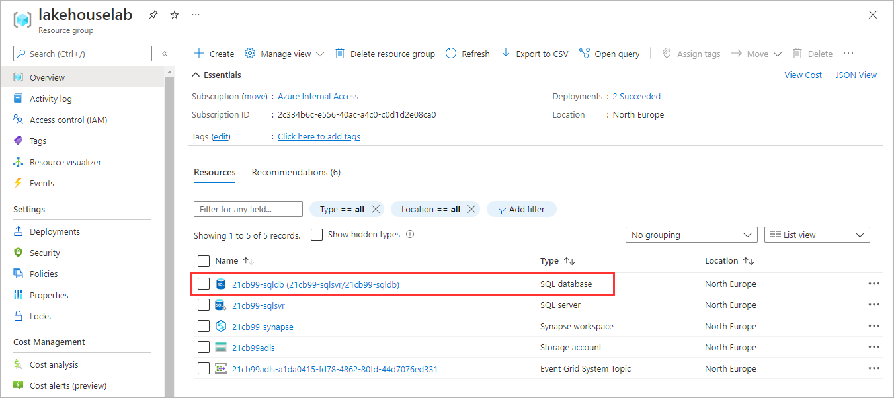
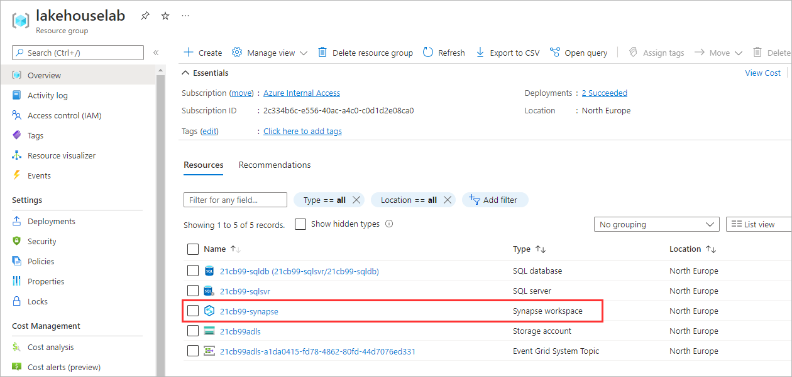
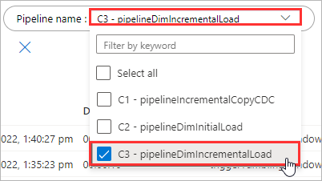

# Module 01D - Automation using Triggers

[< Previous Module](../modules/module01c.md) - **[Home](../README.md)** - [Next Module >](../modules/module02a.md)

## :thinking: Prerequisites

- [x] Lab environment deployed
- [x] Module 1A complete
- [x] Module 1B complete
- [x] Module 1C complete

## :loudspeaker: Introduction

In this module, we will automate ingestion and loading of Customer data using triggers.

## :dart: Objectives

- Periodically copy changes from source using a Tumbling Window trigger.
- On the arrival of new files in the data lake, incrementally load the dimension table using a Storage Event trigger.

## Table of Contents

- [1. Trigger (Tumbling Window)](#1-Trigger-Tumbling-Window)
- [2. Trigger (Storage Event)](#2-Trigger-Storage-Event)
- [3. Load Additional Data into dbo.Customers](#3-Load-Additional-Data-into-dboCustomers)
- [4. Monitor](#4-Monitor)
- [5. Query Delta Lake](#5-Query-Delta-Lake)

## 1. Trigger (Tumbling Window)

1. Navigate to the **Integrate** hub

    

2. Open the pipeline `C1 - pipelineIncrementalCopyCDC`

    

3. Click **Add trigger** and select **New/Edit**

    

4. Open the **Choose trigger...** drop-down menu and click **New**

    

5. Rename the trigger to `triggerTumblingWindow5m`

    

6. Set the **Type** to **Tumbling window**

    

7. Set the **Recurrence** to **5 minutes**

    

8. Click **OK**

    

9. Copy and paste the snippet below for **triggerStartTime**

```javascript
@formatDateTime(trigger().outputs.windowStartTime,'yyyy-MM-dd HH:mm:ss.fff')
```



10. Copy and paste the snippet below for **triggerEndTime**

```javascript
@formatDateTime(trigger().outputs.windowEndTime,'yyyy-MM-dd HH:mm:ss.fff')
```


11. Click **OK**

    

12. Click **Publish all**

    

13. Click **Publish**

    

<div align="right"><a href="#module-01d---automation-using-triggers">↥ back to top</a></div>

## 2. Trigger (Storage Event)

1. Navigate to the **Integrate** hub

    

2. Open the pipeline `C3 - pipelineDimIncrementalLoad`

    

3. Click **Add trigger** and select **New/Edit**

    

4. Open the **Choose trigger...** drop-down menu and click **New**

    

5. Rename the trigger to `triggerStorageEvent`

    

6. Set the **Type** to **Storage events**

    

7. Provide the **Azure storage account** details
    - **Azure subscription** to the Azure subscription that contains your Azure Data Lake Storage Gen2 account
    - **Storage account name** to the Azure Data Lake Storage Gen2 account name
    - **Container name** via the drop-down menu to `01-raw`

    

8. Set the **Blob path begins** with to `wwi/customers`

    

9. Set the **Blob path ends with** to `.csv`

    

10. Set the **Event** to `Blob created`

    

11. Click **Continue**

    

12. Click **Continue**

    

13. Copy and paste the code snippet to set the **Trigger Run Parameter** (fileName) and click **OK**

```javascript
@trigger().outputs.body.fileName
```


14. Click **Publish all**

    

15. Click **Publish**

    

<div align="right"><a href="#module-01d---automation-using-triggers">↥ back to top</a></div>

## 3. Load Additional Data into dbo.Customers

1. Navigate to the **SQL database**

    

2. Click **Query editor**

    

3. Click **Continue us <your_alias>@<your_domain>.com**

    

4. Copy and paste the code snippets below and click **Run**

```sql
UPDATE dbo.Customers SET CustomerAddress = '34 Park Road, East London, E9 7RW' WHERE CustomerID = 5;
INSERT INTO dbo.Customers (CustomerAddress)
VALUES
    ('169 Manchester Road, Preston, PR35 8AQ'),
    ('52 Broadway, Plymouth, PL39 3PY');
SELECT * FROM [dbo].[Customers];
```


<div align="right"><a href="#module-01d---automation-using-triggers">↥ back to top</a></div>

## 4. Monitor

1. Navigate to the **Synapse workspace**

    

2. Open **Synapse Studio**

    

3. Navigate to the **Monitor** hub

    

4. Under **Integration**, click **Pipeline runs**

    

5. Set the **Pipeline name** filter to `C1 - pipelineIncrementalCopyCDC`

    

6. Periodically click **Refresh** until the next instance of the pipeline is triggered to run from the Tumbling Window trigger

    

7. Once successful, change the **Pipeline name** filter to `C3 - pipelineDimIncrementalLoad`

    

8. Periodically click **Refresh** until you observe a successful instance

    

<div align="right"><a href="#module-01d---automation-using-triggers">↥ back to top</a></div>

## 5. Query Delta Lake

1. Navigate to the **Data** hub

    

2. Browse the data lake folder structure to `03-curated > wwi > customers`, right-click one of the **parquet** files, and select **New SQL Script > Select TOP 100 rows**

    

3. Modify the **OPENROWSET** function to remove the file name from the **BULK** path, change the **FORMAT** to **DELTA** and click **Run**

    

<div align="right"><a href="#module-01d---automation-using-triggers">↥ back to top</a></div>

## :tada: Summary

You have successfully automated the execution of the Customer pipelines using triggers.

[Continue >](../modules/module02a.md)