# Module 01D - Automation using Triggers

[< Previous Module](../modules/module01c.md) - **[Home](../README.md)** - [Next Module >](../modules/module02a.md)

## :thinking: Prerequisites

- [x] Lab environment deployed
- [x] Module 1A complete
- [x] Module 1B complete
- [x] Module 1C complete

## :loudspeaker: Introduction

In this module, we will automate ingestion and loading of Customer data using triggers.

## :dart: Objectives

- Periodically copy changes from source using a Tumbling Window trigger.
- On the arrival of new files in the data lake, incrementally load the dimension table using a Storage Event trigger.

## Table of Contents

1. [Trigger (Tumbling Window)](#1-Trigger-Tumbling-Window)
2. [Trigger (Storage Event)](#2-Trigger-Storage-Event)
3. [Load Additional Data into dbo.Customers](#3-Load-Additional-Data-into-dboCustomers)
4. [Monitor](#4-Monitor)
5. [Query Delta Lake](#5-Query-Delta-Lake)

## 1. Trigger (Tumbling Window)

[Tumbling window triggers](https://docs.microsoft.com/azure/data-factory/how-to-create-tumbling-window-trigger) are a type of [trigger](https://docs.microsoft.com/azure/data-factory/concepts-pipeline-execution-triggers) that fires at a periodic time interval. In this step, we will create a new tumbling window trigger that will be associated with the pipeline `C1 - pipelineIncrementalCopyCDC`. The trigger will be set to run every 5 minutes and pass trigger outputs (`windowStartTime` and `windowEndTime`) to the corresponding pipeline parameters (`triggerStartTime` and `triggerEndTime`).

```mermaid

flowchart TB

t1[Trigger\ntriggerTumblingWindow5m]
p1[Pipeline\nC1 - pipelineIncrementalCopyCDC]
ds1[(Azure SQL Database\ncdc.dbo_Customers_CT)]
ds2[(Azure Data Lake\nraw)]

t1--"triggerStartTime = trigger().outputs.windowStartTime\ntriggerEndTime = trigger().outputs.windowEndTime"-->sg

subgraph sg[Data Movement]
ds1-.source.->p1-.sink.->ds2
end

```

1. Navigate to the **Integrate** hub

    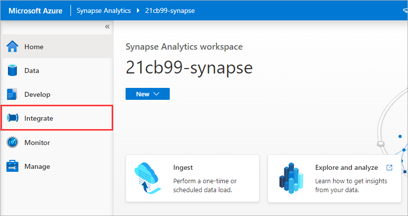

2. Open the pipeline `C1 - pipelineIncrementalCopyCDC`

    

3. Click **Add trigger** and select **New/Edit**

    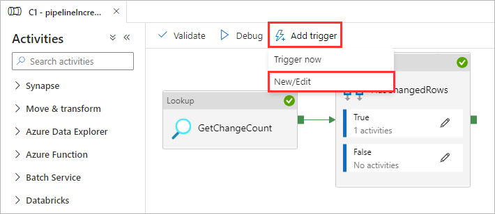

4. Open the **Choose trigger...** drop-down menu and click **New**

    

5. Rename the trigger to `triggerTumblingWindow5m`

    

6. Set the **Type** to **Tumbling window**

    

7. Set the **Recurrence** to **5 minutes**

    

8. Click **OK**

    

9. Copy and paste the snippet below for **triggerStartTime**

    ```javascript
    @formatDateTime(trigger().outputs.windowStartTime,'yyyy-MM-dd HH:mm:ss.fff')
    ```

    

10. Copy and paste the snippet below for **triggerEndTime**

    ```javascript
    @formatDateTime(trigger().outputs.windowEndTime,'yyyy-MM-dd HH:mm:ss.fff')
    ```

    

11. Click **OK**

    

12. Click **Publish all**

    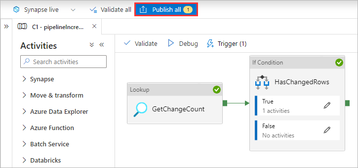

13. Click **Publish**

    

<div align="right"><a href="#module-01d---automation-using-triggers">↥ back to top</a></div>

## 2. Trigger (Storage Event)

[Storage event triggers](https://docs.microsoft.com/azure/data-factory/how-to-create-event-trigger) are a type of [trigger](https://docs.microsoft.com/azure/data-factory/concepts-pipeline-execution-triggers) that fire when certain types of storage events occur (e.g. `Blob created` or `Blob deleted` ). In this step, we will create a new storage event trigger that will be associated with the pipeline `C3 - pipelineDimIncrementalLoad`. The trigger will be set to fire whenever a `Blob created` event occurs within the `01-raw/wwi/customers` directory for blob paths that end in `.csv`. Trigger output `@trigger().outputs.body.fileName` will be passed to the pipeline parameter `fileName`.

```mermaid

flowchart TB

t2[Trigger\ntriggerStorageEvent]
p2[Pipeline\nC3 - pipelineDimIncrementalLoad]
ds2[(Azure Data Lake\nraw)]
ds3[(Azure Data Lake\ncurated)]

t2--"fileName = @trigger().outputs.body.fileName"-->sg

subgraph sg[Data Movement]
ds2-.source.->p2-.sink.->ds3
end

```

1. Navigate to the **Integrate** hub

    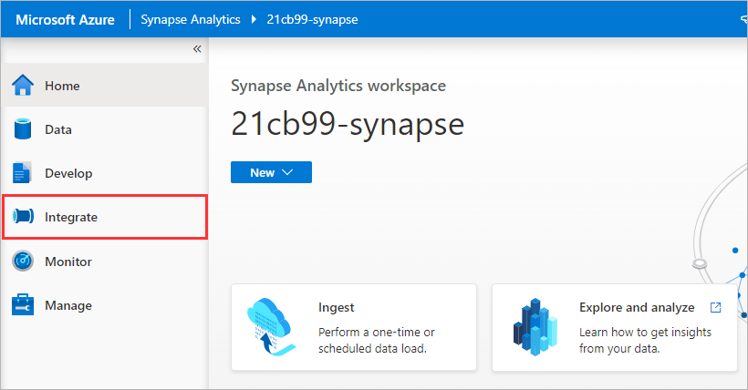

2. Open the pipeline `C3 - pipelineDimIncrementalLoad`

    

3. Click **Add trigger** and select **New/Edit**

    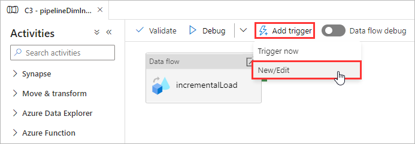

4. Open the **Choose trigger...** drop-down menu and click **New**

    

5. Rename the trigger to `triggerStorageEvent`

    

6. Set the **Type** to **Storage events**

    

7. Provide the **Azure storage account** details
    - **Azure subscription** to the Azure subscription that contains your Azure Data Lake Storage Gen2 account
    - **Storage account name** to the Azure Data Lake Storage Gen2 account name
    - **Container name** via the drop-down menu to `01-raw`

    

8. Set the **Blob path begins** with to `wwi/customers`

    

9. Set the **Blob path ends with** to `.csv`

    

10. Set the **Event** to `Blob created`

    

11. Click **Continue**

    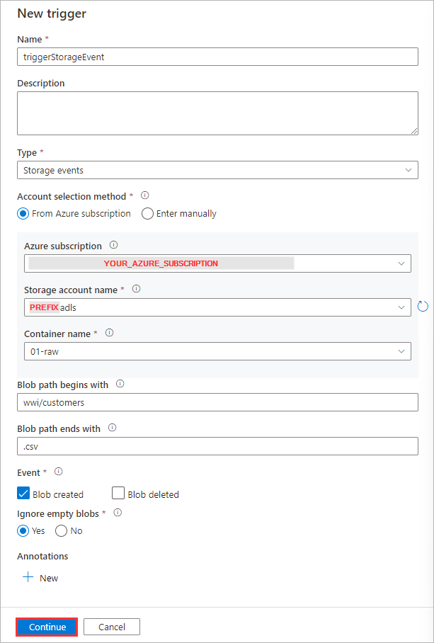

12. Click **Continue**

    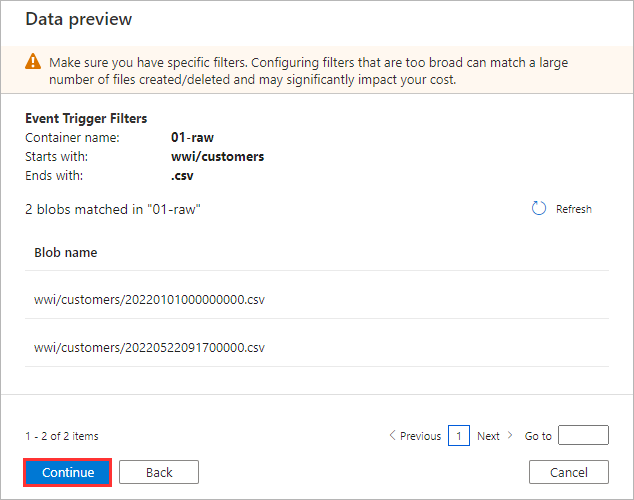

13. Copy and paste the code snippet to set the **Trigger Run Parameter** (fileName) and click **OK**

    ```javascript
    @trigger().outputs.body.fileName
    ```

    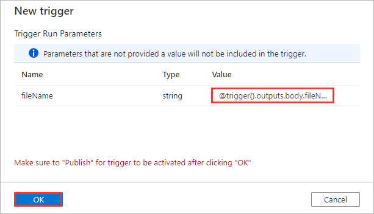

14. Click **Publish all**

    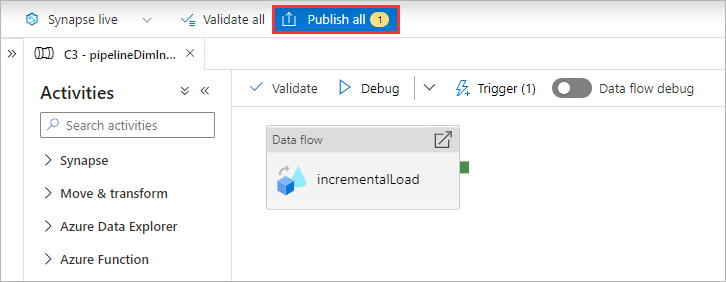

15. Click **Publish**

    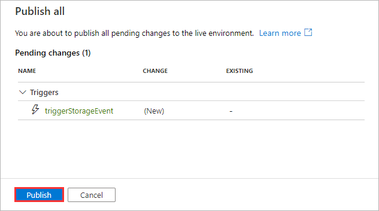

<div align="right"><a href="#module-01d---automation-using-triggers">↥ back to top</a></div>

## 3. Load Additional Data into dbo.Customers

In this step, we will execute SQL code within the **Azure SQL Database** (source system) against the target table `dbo.Customers`. The code will make changes to existing customer records (UPDATE), as well as the addition of net new customer records (INSERT).

```mermaid
flowchart LR
ds1[(Azure SQL Database\ncdc.dbo_Customers_CT)]
sql[/SQL Code/]
sql-.UPDATE/INSERT.->ds1
```

1. Navigate to the **SQL database**

    

2. Click **Query editor**

    

3. Click **Continue us <your_alias>@<your_domain>.com**

    

4. Copy and paste the code snippets below and click **Run**

```sql
UPDATE dbo.Customers SET CustomerAddress = '34 Park Road, East London, E9 7RW' WHERE CustomerID = 5;
INSERT INTO dbo.Customers (CustomerAddress)
VALUES
    ('169 Manchester Road, Preston, PR35 8AQ'),
    ('52 Broadway, Plymouth, PL39 3PY');
SELECT * FROM [dbo].[Customers];
```


<div align="right"><a href="#module-01d---automation-using-triggers">↥ back to top</a></div>

## 4. Monitor

Within Synapse Studio, the [Monitor](https://docs.microsoft.com/azure/synapse-analytics/get-started-monitor) hub can be used to see the status of Synapse resources such as analytic pools and integration runtimes, and the history of Synapse activities such as SQL requests and pipeline runs.

Since our pipelines are being automatically executed based on triggers, the data changes applied in the previous step will result in data automatically flowing from source (Azure SQL Database) to destination (Azure Data Lake Storage Gen2), then subsequently transformed before finally being loaded in the Delta Lake table format.

- The tumbling window trigger will execute `C1 - pipelineIncrementalCopyCDC` every 5 minutes.
- If changes are detected, data is copied to ADLS Gen 2 (raw).
- Upon the detection of a new CSV file, the storage event trigger will execute `C3 - pipelineDimIncrementalLoad`.
- The pipeline will cross-check the raw data (CSV) against the existing curated data (Delta Lake) and UPSERT the new data adhering to the SCD Type 2 pattern.

```mermaid

flowchart TB

t1[Trigger\ntriggerTumblingWindow5m]
p1[Pipeline\nC1 - pipelineIncrementalCopyCDC]
ds1[(Azure SQL Database\ncdc.dbo_Customers_CT)]
ds2[(Azure Data Lake\nraw)]

t1--"triggerStartTime = trigger().outputs.windowStartTime\ntriggerEndTime = trigger().outputs.windowEndTime"-->sg1

subgraph sg1[Data Movement]
ds1-.source.->p1-.sink.->ds2
end

sg1-.->t2

t2[Trigger\ntriggerStorageEvent]
p2[Pipeline\nC3 - pipelineDimIncrementalLoad]
ds2a[(Azure Data Lake\nraw)]
ds3[(Azure Data Lake\ncurated)]

t2--"fileName = @trigger().outputs.body.fileName"-->sg2

subgraph sg2[Data Movement]
ds2a-.source.->p2-.sink.->ds3
end

```

In this step, we will use the Monitor hub to track the automated execution of our pipelines post the arrival of new data from the source system.

1. Navigate to the **Synapse workspace**

    

2. Open **Synapse Studio**

    

3. Navigate to the **Monitor** hub

    

4. Under **Integration**, click **Pipeline runs**

    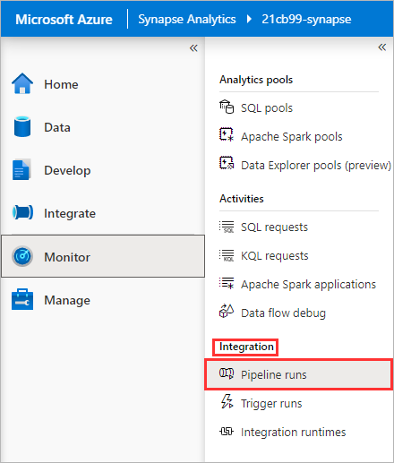

5. Set the **Pipeline name** filter to `C1 - pipelineIncrementalCopyCDC`

    

6. Periodically click **Refresh** until the next instance of the pipeline is triggered to run from the Tumbling Window trigger

    

7. Once successful, change the **Pipeline name** filter to `C3 - pipelineDimIncrementalLoad`

    

8. Periodically click **Refresh** until you observe a successful instance

    

<div align="right"><a href="#module-01d---automation-using-triggers">↥ back to top</a></div>

## 5. Query Delta Lake

[Serverless SQL pool](https://docs.microsoft.com/azure/synapse-analytics/sql/on-demand-workspace-overview) is a query service that comes with every Azure Synapse Analytics workspace. Serverless SQL pool enables you to query files such as Parquet, Delta Lake, and delimited text formats, from the Azure Data Lake, without the need to copy or load data into a specialized store.

In this step, we will use the Serverless SQL pool query service to execute familiar T-SQL syntax to query the newly loaded customer data from the Delta Lake table.

```mermaid
flowchart LR
ds1[(Azure Data Lake\ncurated)]
sql[/SQL Code/]
sql-.SELECT * FROM DELTA.->ds1
```

1. Navigate to the **Data** hub

    

2. Browse the data lake folder structure to `03-curated > wwi > customers`, right-click one of the **parquet** files, and select **New SQL Script > Select TOP 100 rows**

    

3. Modify the **OPENROWSET** function to remove the file name from the **BULK** path, change the **FORMAT** to **DELTA** and click **Run**

    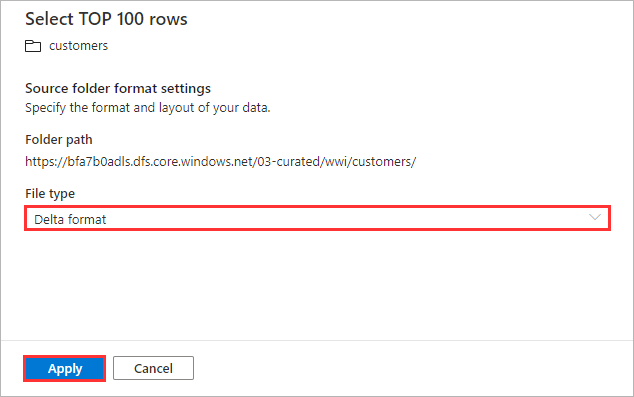

<div align="right"><a href="#module-01d---automation-using-triggers">↥ back to top</a></div>

## :tada: Summary

You have successfully automated the execution of the Customer pipelines using triggers.

[Continue >](../modules/module02a.md)
