# Module 04 - Data Visualization with Power BI

[< Previous Module](../modules/module03.md) - **[Home](../README.md)**

## :thinking: Prerequisites

- [x] Lab environment deployed
- [x] Module 1D complete
- [x] Module 2C complete
- [x] Module 3 complete
- [x] [Power BI Desktop](https://aka.ms/pbiSingleInstaller)

## :loudspeaker: Introduction

In this module, we will develop and publish a Power BI report based on data from our logical data warehouse.

```mermaid
flowchart LR
ds[(Data Lake\ncurated)]
ds-.->v1
ds-.->v2
subgraph Azure Synapse Analytics
v1[View\nwwi.customers]
v2[View\nwwi.orders]
sql["Serverless SQL Endpoint\n[prefix]-synapse-ondemand.azuresynapse.net"]
end
pbi["Power BI Desktop\nPBIX"]
v1-.->sql
v2-.->sql
sql-.Import Mode.->pbi
```

## :dart: Objectives

- Create a Power BI report
- Connect to the Serverless SQL endpoint
- Consume data from the logical data warehouse
- Publish the Power BI report

## Table of Contents

 1. [Connect Power BI to Azure Synapse Analytics](#1-Connect-Power-BI-to-Azure-Synapse-Analytics)
 2. [Data Visualization #1: Table](#2-Data-Visualization-1-Table)
 3. [Data Visualization #2: Chart](#3-Data-Visualization-2-Chart)
 4. [Save and Publish](#4-Save-and-Publish)

## 1. Connect Power BI to Azure Synapse Analytics

In this step, we will open **Power BI Desktop**, and connect to **Azure Synapse Analytics Serverless SQL Endpoint** using **Import** mode. Once connected, we will select our two views: `wwi.customers` and `wwi.orders`.

1. Open Power BI Desktop

    

2. Click **Get data**

    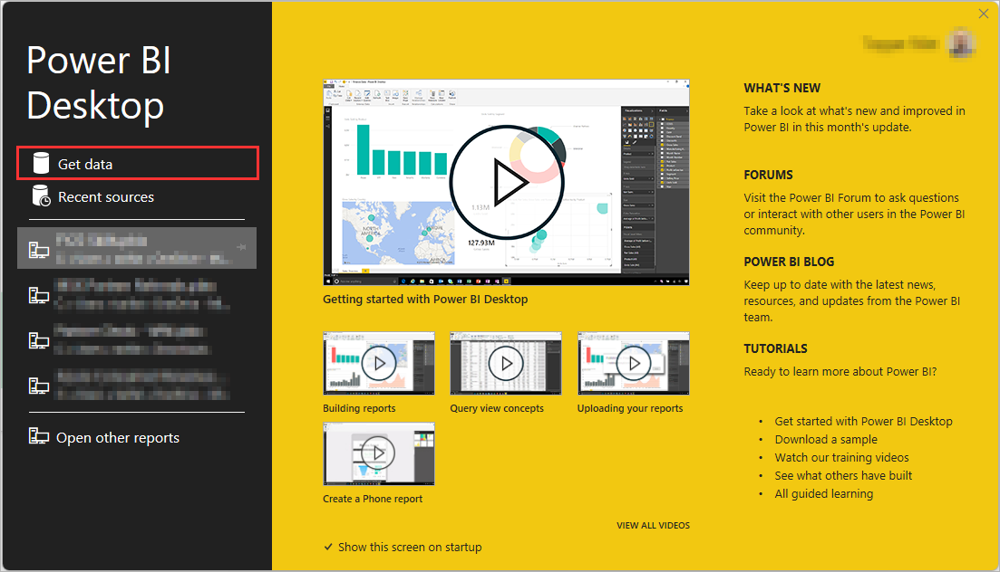

3. Search `Synapse`, select **Azure Synapse Analytics SQL**, and click **Connect**

    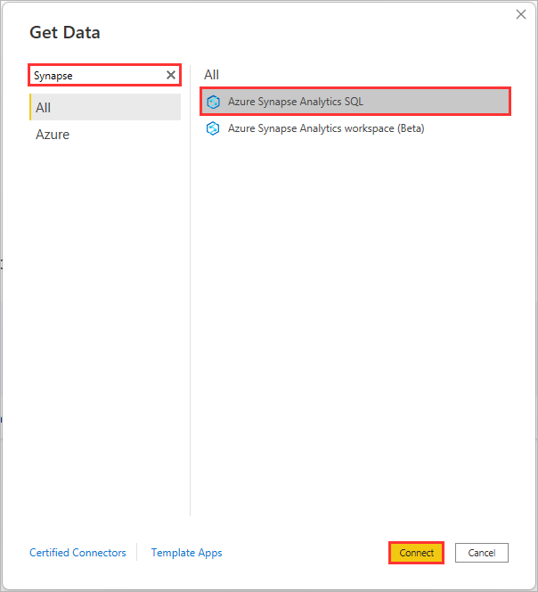

4. Open the [Azure Portal](https://portal.azure.com), navigate to the **Synapse Workspace** resource, and copy the **Serverless SQL endpoint**

    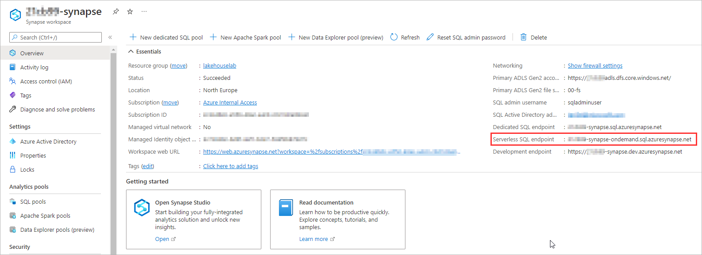

5. Return to Power BI Desktop, paste the Serverless SQL endpoint within the **Server** property, set **Data connectivity mode** to **Import**, and click **OK**

    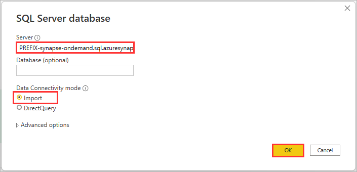

6. Sign-in with your **Microsoft account** and click **Connect**

    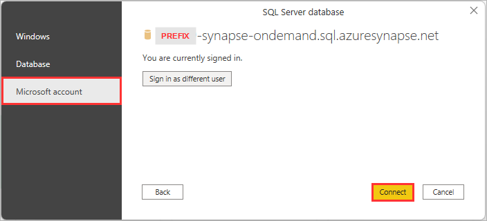

7. Expand the `ldw` database, select `wwi.customers` and `wwi.orders`, and click **Load**

    

8. Switch to the **Model** view and create a relationship between the `CustomerSK` in `wwi.Customers` and the `CustomerKey` in `wwi.Orders`

    

9. Revert back to the **Report** view

    

<a href="#module-04---data-visualization-with-power-bi">↥ back to top</a>

## 2. Data Visualization #1: Table

In this step, we will create a **table** visualization to show a list of customer orders.

1. From the **Visualizations** pane, click the **Table** icon

    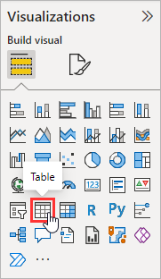

2. From the **Fields** pane, select `OrderID`, `CustomerID`, `CustomerAddress`, and `Quantity`

    

3. Within the **Visualizations** pane, under **Values**, right-click on `OrderID` and select **Don't summarize**

    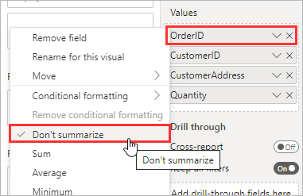

4. Within the **Visualizations** pane, under **Values**, right-click on `CustomerID` and select **Don't summarize**

    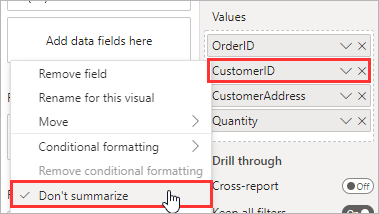

5. Within the **Visualizations** pane, switch to the **Format visual** sub-pane, click the **General** tab, enable **Title**, and set the **Title** to `Orders`

    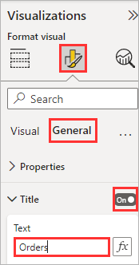

<a href="#module-04---data-visualization-with-power-bi">↥ back to top</a>

## 3. Data Visualization #2: Chart

In this step, we will create a **bar chart** visualization to show the quantity distribution by customer address.

1. From the **Visualizations** pane, click the **Stacked bar chart** icon

    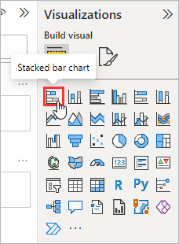

2. From the **Fields** pane, select `CustomerAddress` and `Quantity`

    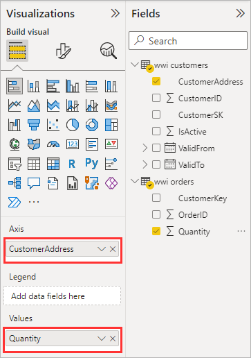

3. Within the **Visualizations** pane, switch to the **Format visual** sub-pane, expand the **Y-axis** and set the **Max area width** to `50%`

    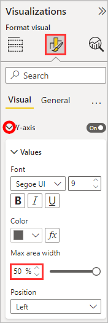

4. Set **Data labels** to `ON`

    

5. Expand the **X-axis**, turn the **Title** `Off`, then turn the **X-axis** `Off`

    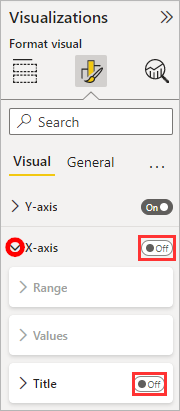

<a href="#module-04---data-visualization-with-power-bi">↥ back to top</a>

## 4. Save and Publish

In this step, we will save and **publish** our Power BI report to a workspace.

1. Under **Home**, click **Publish**

    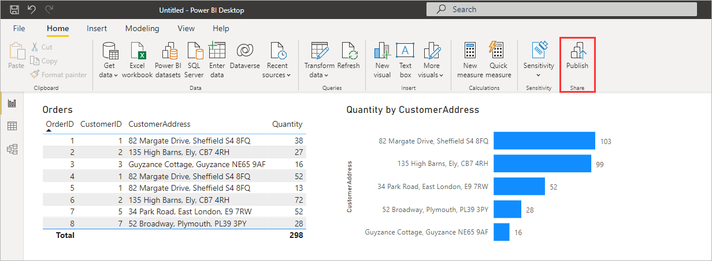

2. When prompted to save changes, click **Save**. Note: You may be prompted to set a Sensitivity Label prior to being able to save.

    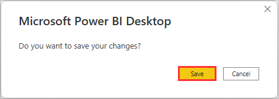

3. Provide the Power BI report a file name (e.g. `Data Lakehouse Workshop`) and click **Save**

    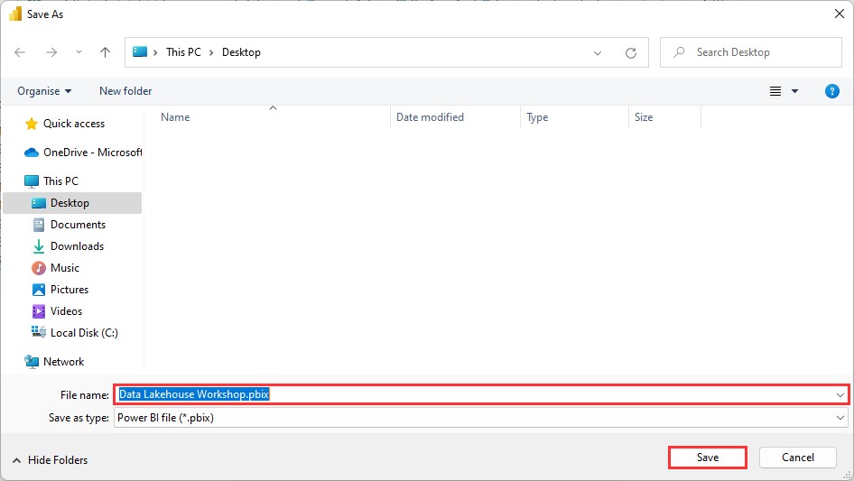

4. Select `My workspace` and click **Select**

    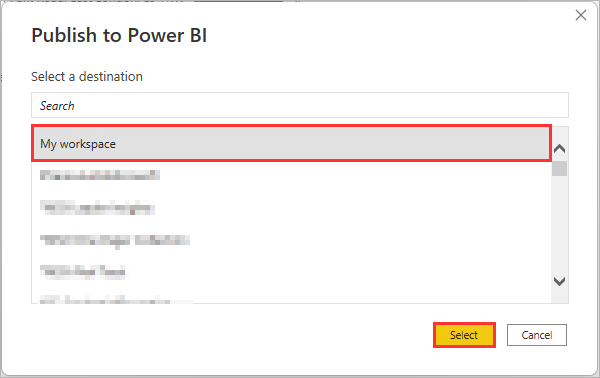

5. Once published, click the hyperlink to open the report in Power BI

    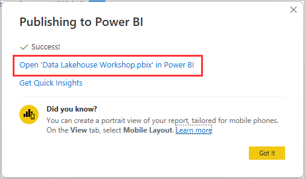

<a href="#module-04---data-visualization-with-power-bi">↥ back to top</a>

## :tada: Summary

You have successfully created a Power BI report, consuming data from the data lakehouse using Azure Synapse Analytics.
